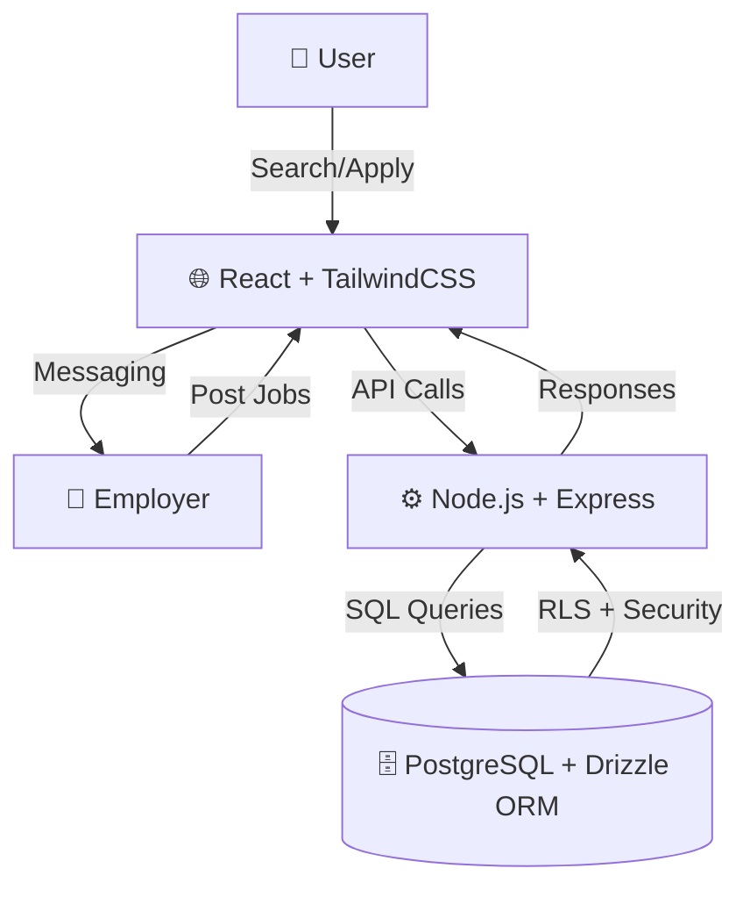

# 🌐 *Skill Connect*

A modern digital job marketplace designed to connect **local job seekers and employers** through **skill-based matching, application tracking, and in-app messaging**.  
Built with a robust full-stack architecture, the platform emphasizes **speed, usability, and security**, making hiring and job hunting more efficient for local communities.


## ✨ Features
- 🔍 **Skill-based Job Matching** – Find the most relevant opportunities based on skills & location.  
- 📝 **Job Posting & Management** – Employers can create, update, and manage listings seamlessly.  
- 📩 **Application Tracking** – Job seekers can apply, track, and manage their applications.  
- 💬 **In-app Messaging** – Secure communication between employers and applicants.  
- 🔐 **Secure Authentication** – Passwords hashed with bcrypt, with support for SSL/TLS & pgcrypto encryption.  
- ⚡ **Responsive UI** – Modern, mobile-friendly design using React + TailwindCSS.  

---

## 🛠️ Tech Stack


- **🎨 Frontend** → React ⚛️ + TypeScript + TailwindCSS 💨 + Radix UI
- **⚙️ Backend** → Node.js 🌐 + Express 🚀
- **🗄️ Database** → PostgreSQL 🐘 + Drizzle ORM
- **🛡️ Security** → bcrypt 🔐 + pgcrypto 🔒 + RLS
- **📦 Tools** → GitHub, VS Code, Figma 🎨
- **☁️ Hosting** → Vercel/Netlify (frontend), Render/Railway (backend), Neon DB (database)


---
## 🎯 Motivation & Objectives
- Bridge the gap between **local talent and employers** effectively.  
- Provide a **user-friendly platform** for fast and relevant job searching.  
- Encourage **local employment growth** through skill and location-based matching.  
- Ensure **secure and reliable data handling** with PostgreSQL RLS and role-based access.  

---

## 📊 Project Outcomes
- Successfully connects job seekers and employers based on **skills and location**.  
- Simplifies the hiring process by combining **posting, applying, tracking, and messaging** in one platform.  
- Creates a **faster, more efficient, and user-friendly job marketplace**.  

---

## ⚙️ Setup & Installation


### Prerequisites
- **Node.js** 18 or later
- **PostgreSQL** 14 or later


### Steps


1. **Clone the repository & install dependencies**
```bash
git clone <repository-url>
cd <project-folder>
npm install
```


2. **Configure environment variables**
Create a `.env` file in the project root with the following values:
```env
PORT=5000
DATABASE_URL=postgres://<username>:<password>@localhost:5432/<dbname>
# For managed Postgres with SSL:
# PGSSLMODE=require
# DATABASE_SSL=true
```
> Replace `<username>`, `<password>`, and `<dbname>` with your PostgreSQL credentials.


3. **Create the database**
```sql
CREATE DATABASE <dbname>;
```


4. **Generate and push schema**
```bash
npm run db:generate
npm run db:push
```


---


## 🚀 Development & Deployment


### Development 👨‍💻
```bash
npm run dev
```
➡️ Runs at → [http://127.0.0.1:5000](http://127.0.0.1:5000)


### Production 🚀
```bash
npm run build
npm start
```


---
## 🔐 Security
- Passwords hashed using **bcrypt**.  
- PostgreSQL secured with **RLS (Row-Level Security)** & optional **pgcrypto**.  
- SSL/TLS enabled for managed databases.  

---

## 📅 Plan of Execution
1. **Plan & Design** → Define features, roles, and flows.  
2. **Backend Setup** → APIs with Node.js + PostgreSQL.  
3. **Frontend Development** → Responsive UI with React + Tailwind.  
4. **Feature Integration** → Jobs, applications, messaging, authentication.  
5. **Testing & Deployment** → Debug, optimize, and host live.  

---

## 🏗️ Architecture Diagram

  

---

## 📜 License
This project is developed as part of **CEP (Community Engagement Project)** coursework.  
For academic and demonstration purposes only.  
---
